# EconoMe | TUGAS AKHIR TPM | Semester 6

  <h1>Deskripsi Aplikasi</h1>

  

    Project yang saya buat adalah Aplikasi pencatatan keuangan dengan nama EconoMe. Pada 
    aplikasi ini dapat melakukan pencatatan keuangan mulai dari pemasukan dan pengeluaran. Akan 
    di tampilkan juga total saldo yang sudah tercatat dimana itu adalah pemasukan di kurangi 
    pengeluaran yang tercatat di aplikasi ini. Kemudian terdapat fitur tambahan sesuai reuirement 
    project yakni dapat mengkonversi waktu mulai dari WIB, WIT, dan WITA serta seluruh zona 
    waktu yang ada di dunia. Kemudian dapat mengkonversi mata uang dari seluruh mata uang di 
    dunia. Aplikasi ini sudah terkoneksi di database menggunakan SQLite dan sudah terdapat fitur 
    pencarian serta implementasi API yakni untuk konversi waktu dan mata uang tadi. Aplikasi ini 
    juga sudah menerapkan enkripsi menggunakan chipper text dengan key 5 pada akun user saat 
    melakukan registrasi. Terdapat Menu profile dan menu saran dan kesan, serta sudah 
    mengimplementasikan notifikasi, yakni misalnya notif ketika salah input username atau password 
    di menu login. Jadi, semua requirement dari tugas project akhir nya sudah di implementasikan di 
    aplikasi EconoMe.

  

  <h1>Tampilan</h1>

  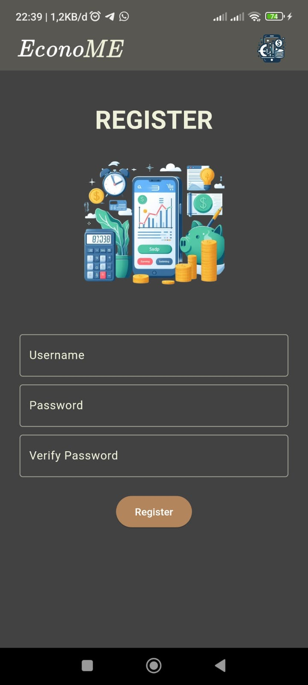&nbsp;
  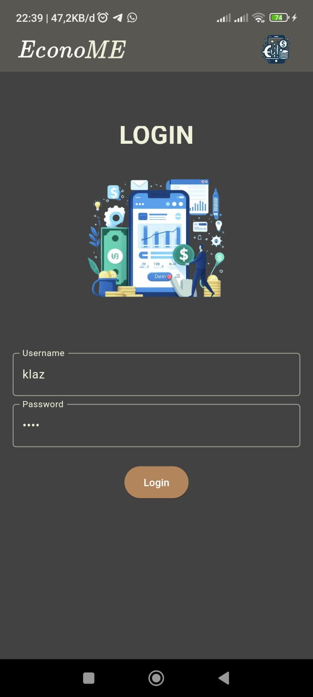&nbsp;
  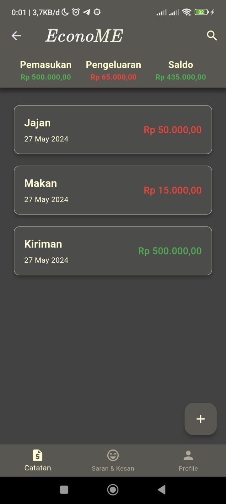&nbsp;

 

  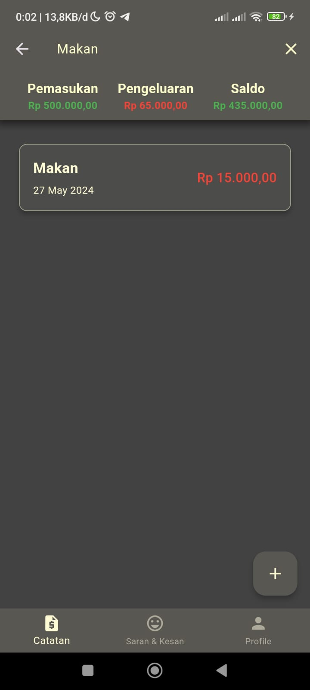&nbsp;
  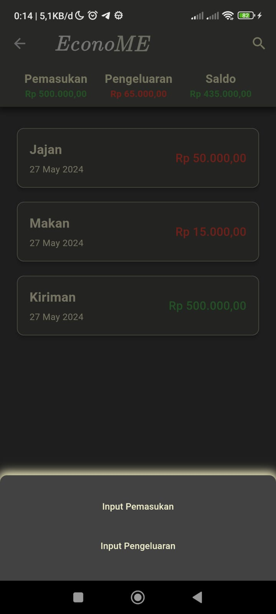&nbsp;
  &nbsp;

  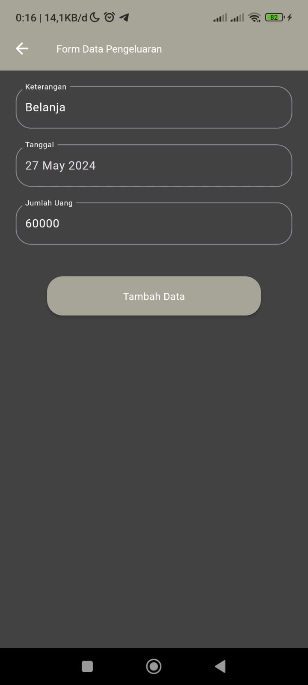&nbsp;
  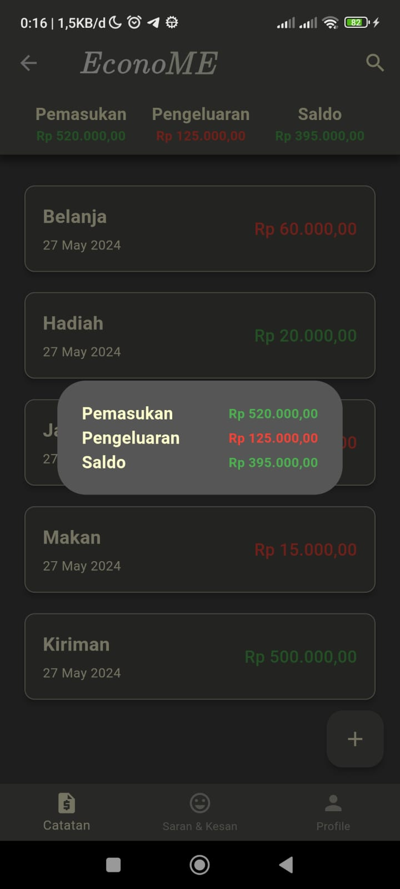&nbsp;
  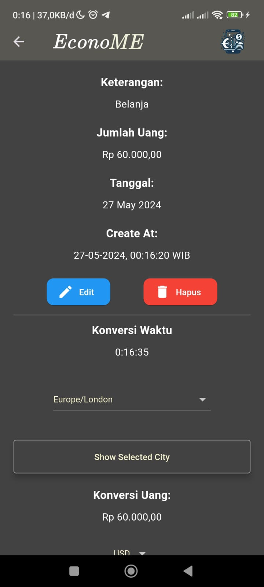&nbsp;

  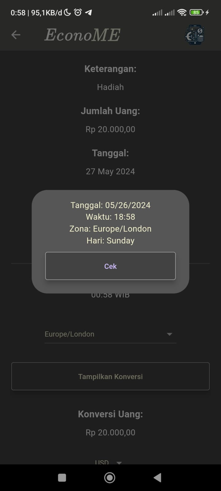&nbsp;
  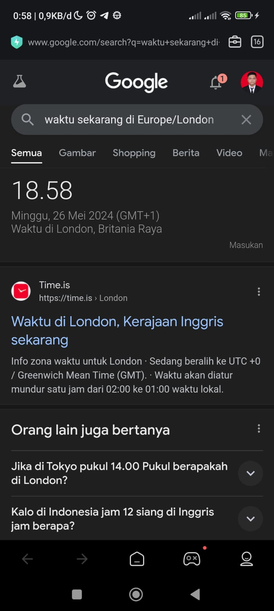&nbsp;
  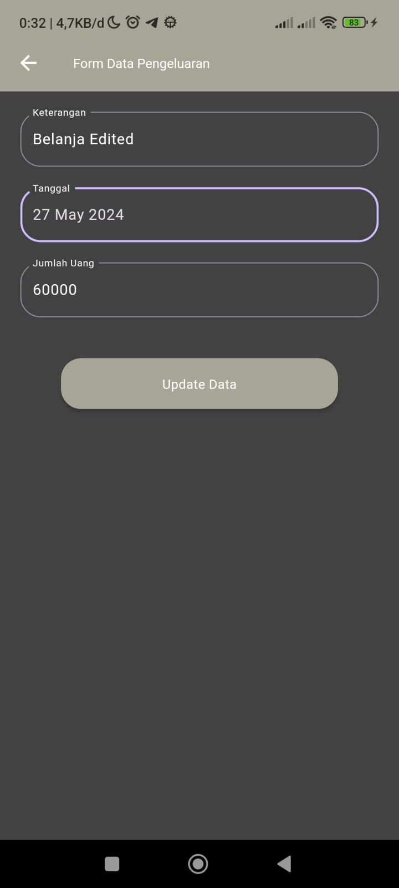&nbsp;

  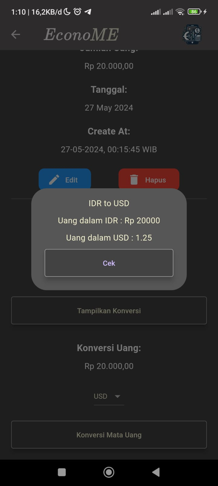&nbsp;
  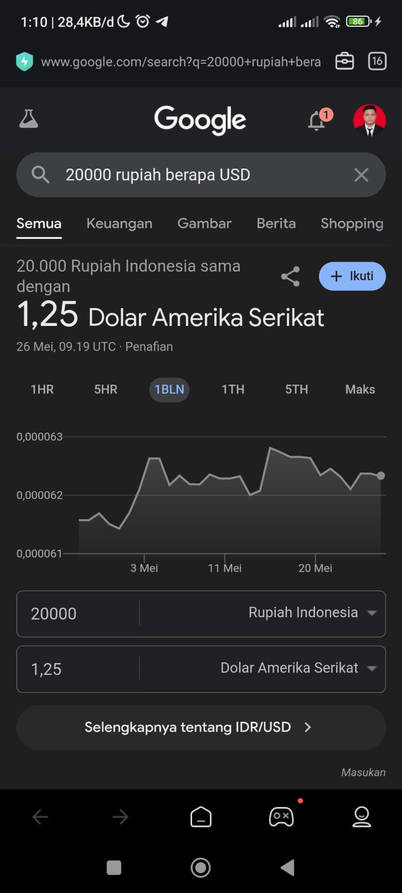&nbsp;
  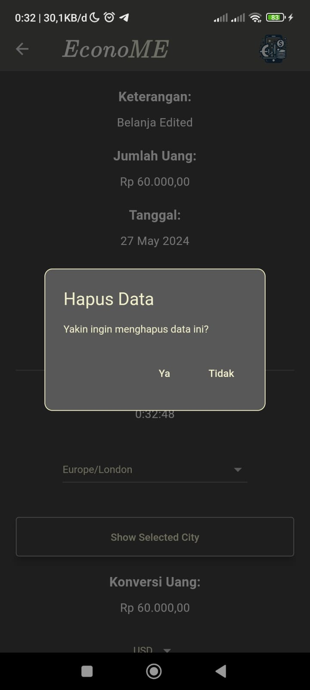&nbsp;

  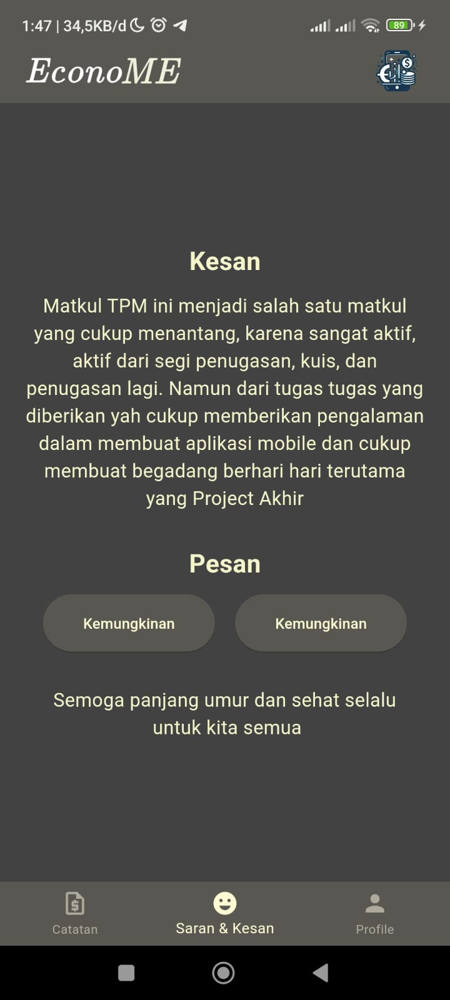&nbsp;
  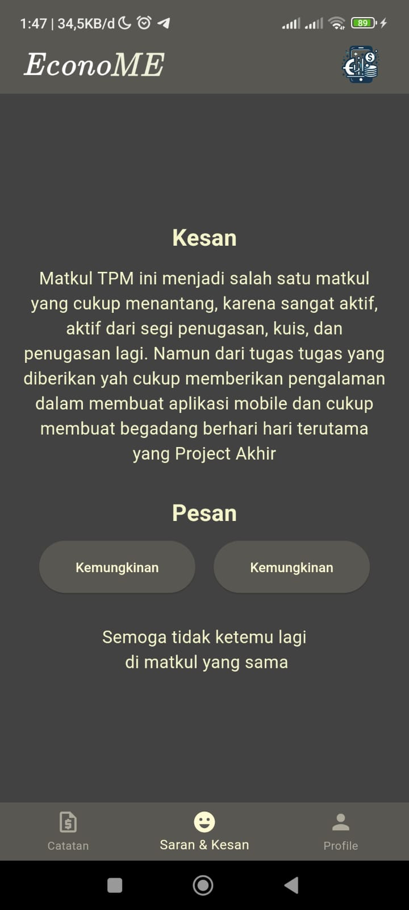&nbsp;
  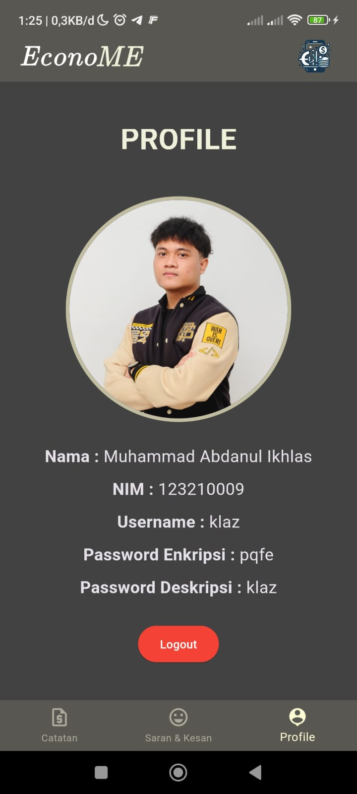&nbsp;

